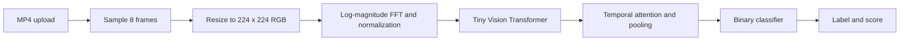

# DFDC_RZ — Video Deepfake Detection Prototype

A video classification prototype that combines frequency-domain image features with temporal attention. Upload an MP4 through the browser interface or FastAPI endpoint to receive a `REAL` / `FAKE` label and model score.

**Status:** inference demo with a bundled checkpoint. Training reproducibility, benchmark performance, and deployment hardening are not established in this repository.

## How it works



[app.py](app.py) implements the complete inference path:

1. OpenCV samples eight evenly spaced frames, scales pixel values to `[0, 1]`, and pads missing frames with zeros when at least one frame is readable.
2. FFT preprocessing produces a normalized log-magnitude representation of the sampled clip.
3. A `timm` `vit_tiny_patch16_224` backbone extracts per-frame features. Four-head temporal attention and mean pooling combine them into a video representation.
4. A two-layer classifier produces a sigmoid score. Values strictly above `0.5` map to `FAKE`; other values map to `REAL`.

The [browser interface](index.html) submits files to the same API. Inference uses CUDA when available and otherwise falls back to CPU. The pipeline operates on full frames; face detection and face cropping are not implemented.

## Run locally

Use Python 3.10, Git, and Git LFS. Python 3.10 matches the [Dockerfile](Dockerfile). Run commands from the repository root because the checkpoint and UI paths are relative to the working directory.

```bash
git lfs install
git clone https://github.com/RAMZI0TO99/DFDC_RZ.git
cd DFDC_RZ
git lfs pull
python -m venv .venv
```

Activate the environment:

```bash
# macOS / Linux
source .venv/bin/activate
```

```powershell
# Windows PowerShell
.venv\Scripts\Activate.ps1
```

Install dependencies and start the server:

```bash
python -m pip install -r requirements.txt
python -m uvicorn app:app --host 127.0.0.1 --port 8000
```

Open `http://127.0.0.1:8000` for the upload interface or `http://127.0.0.1:8000/docs` for the interactive API documentation.

**Dependency status:** [requirements.txt](requirements.txt) pins PyTorch to `2.6.0`, but most other packages are unpinned. A reproducible dependency lock and a verified clean installation are still needed; the commands above describe the intended setup, not a tested installation matrix.

### Docker

After cloning and retrieving the checkpoint with Git LFS:

```bash
docker build -t dfdc-rz .
docker run --rm -p 127.0.0.1:8000:8000 dfdc-rz
```

The image uses Python 3.10 and starts Uvicorn on port 8000. It installs the same requirements as local setup, so it shares their dependency constraints. GPU support is not configured by this Dockerfile.

## API example

`POST /predict` accepts multipart form data with a `file` field. The current filename check requires the lowercase `.mp4` extension.

```bash
curl -X POST http://127.0.0.1:8000/predict -F "file=@sample.mp4"
```

In Windows PowerShell, use `curl.exe` for this command.

Illustrative response shape, **not a measured prediction**:

```json
{
  "prediction": "FAKE",
  "confidence": "82.00%",
  "raw_probability": 0.82
}
```

`raw_probability` is the model's sigmoid score for `FAKE`. `confidence` is that score for a `FAKE` label or its complement for a `REAL` label, formatted as a percentage string. Neither field is a validated probability of authenticity.

The API returns `400` for a non-MP4 filename or a video with no readable frames, and `503` when the checkpoint is missing. Uploaded videos are written temporarily in the working directory and removed after inference.

## Checkpoint and reproducibility

The required file is `best_dfdc_model_v2.pth` in the repository root. It is tracked through Git LFS; the actual checkpoint is **22,854,287 bytes**, while the Git pointer is only 133 bytes. A checkout containing only the pointer cannot load the model. Run `git lfs pull` before starting the app or building the image.

The backbone is constructed with `pretrained=False`, then loaded from this checkpoint. Source comments refer to a Kaggle architecture, but the repository does not include a linked training notebook, dataset version, training configuration, or checkpoint evaluation report. The project name alone does not establish training data provenance.

## Limitations and next steps

- **Evaluation:** no held-out accuracy, AUC, calibration results, or benchmark comparisons are provided. Add a documented evaluation split and reproducible metrics before making performance claims.
- **Coverage:** the model samples eight full frames and ignores audio. Performance across unseen manipulation methods, compression levels, and recording conditions is unverified.
- **Deployment:** this is a local prototype. Authentication, upload size limits, concurrency-safe temporary file handling, and a hardened service configuration are not implemented.
- **Reproducibility:** document training and checkpoint provenance, resolve and lock dependencies, then verify CPU/GPU setup and API behavior with representative test clips.

## License

See the [MIT license](LICENSE).
